<div align="center">
  

  <h1>WoowTech Hermes Agent</h1>
  <p><strong>Enterprise AI Assistant with Dual GUI, 47 CLI Tools, 93 Skills, and Multi-Instance White-Label Deployment</strong></p>

  <p>
    
    
    
    
    
    
    
  </p>

  <p>
    <a href="README.md">English</a> |
    <a href="README_zh-TW.md">繁體中文</a>
  </p>
</div>

---

## Table of Contents

- [Overview](#overview)
- [Key Features](#key-features)
- [Architecture](#architecture)
- [System Components](#system-components)
- [Service URLs](#service-urls)
- [MCP Integration](#mcp-integration)
- [Browser Terminal (ttyd)](#browser-terminal-ttyd)
- [Screenshots](#screenshots)
- [Deployment Options](#deployment-options)
- [Quick Start](#quick-start)
- [Configuration](#configuration)
- [Custom Docker Image](#custom-docker-image)
- [Multi-Instance Deployment](#multi-instance-deployment)
- [White-Label Branding](#white-label-branding)
- [CLI Tools Reference](#cli-tools-reference)
- [Skills Catalog](#skills-catalog)
- [API Reference](#api-reference)
- [Testing](#testing)
- [Security](#security)
- [Troubleshooting](#troubleshooting)
- [Changelog](#changelog)
- [Support & License](#support--license)

---

## Overview

**WoowTech Hermes Agent** is an enterprise-grade, self-hosted AI assistant platform built on [Nous Research Hermes Agent](https://github.com/NousResearch/hermes-agent) and [Hermes WebUI](https://github.com/nesquena/hermes-webui). It provides a complete AI workspace with dual GUI (Chat WebUI + Dashboard), 47 pre-installed CLI tools, 93 AI skills, and multi-LLM support — all deployable on either K3s Kubernetes or Podman with automated white-label branding.

### Why WoowTech Hermes?

| Challenge | WoowTech Solution |
|-----------|-------------------|
| SaaS AI tools leak sensitive data | **Self-hosted** on your own infrastructure |
| One-size-fits-all AI assistants | **93 domain skills** including Odoo 18 ERP, ESG/WELL/LEED, finance |
| Single-model lock-in | **Multi-LLM**: MiniMax M2.7 primary + OpenAI/Claude/GLM via OpenRouter |
| No browser automation | **Playwright + Chromium 148** built into the agent container |
| Complex Kubernetes setup | **One-command deployment** with `deploy.sh` + golden configs |
| Single-tenant only | **Multi-instance** with namespace isolation + per-tenant branding |

### Live Instances

| Instance | Domain | Purpose |
|----------|--------|---------|
| WoowTech | `woowtech-hermes.woowtech.io` | Odoo 18 ERP Consultant |
| Apporo Alan | `apporoalan-hermes.woowtech.io` | ESG/WELL/LEED Building Consultant |
| Johhan Lin | `johhanlin-hermes.woowtech.io` | Forex Consultant |
| Alan Lin | `alanlin-hermes.woowtech.io` | General AI Assistant |
| TorchMedia | `torchmedia-hermes.woowtech.io` | General AI Assistant |

---

## Key Features

| Feature | Description |
|---------|-------------|
| **Dual GUI** | WebUI (:8787) for chat + Dashboard (:9119) for 150+ settings, Terminal TUI |
| **47 CLI Tools** | curl, git, jq, yq, rg, fd, gcloud, gh, pandoc, ffmpeg, yt-dlp, nmap, and more |
| **93 AI Skills** | 19 categories: software-dev, creative, MLOps, Odoo ERP, research, media |
| **Multi-LLM** | MiniMax M2.7 (primary), GPT-5.x/4.x via OpenRouter, Claude, GLM |
| **Model Routing** | Gateway `model_routes` with `@openai:` and `@openai-api:` prefix support |
| **Playwright + Chromium** | Built-in browser automation for screenshots, form filling, E2E testing |
| **Persistent Memory** | SOUL.md (identity), USER.md (preferences), MEMORY.md (learned context) |
| **Kanban + Tasks** | Project boards, todo lists, cron job scheduling |
| **Insights Analytics** | Token usage, model distribution, cost tracking |
| **Gateway API** | OpenAI-compatible REST API on port 8642 |
| **White-Label Branding** | Custom logos, colors, titles per instance |
| **Cloudflare Tunnel** | Automatic HTTPS without port forwarding or certificates |

---

## Architecture

### System Architecture

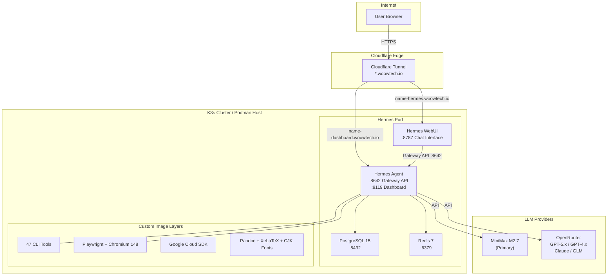

### Multi-Instance Architecture

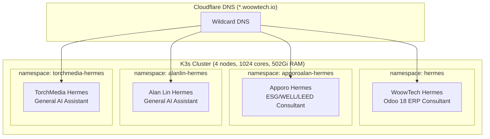

### Request Flow

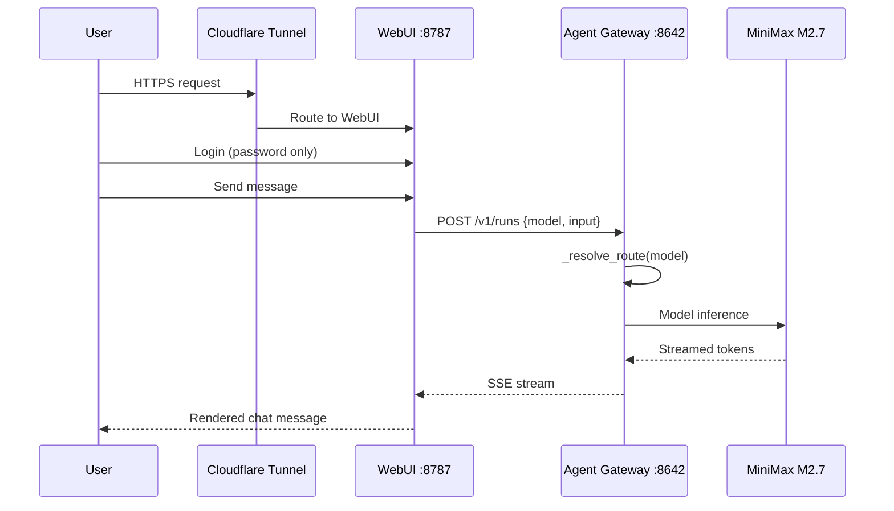

### Docker Image Layers

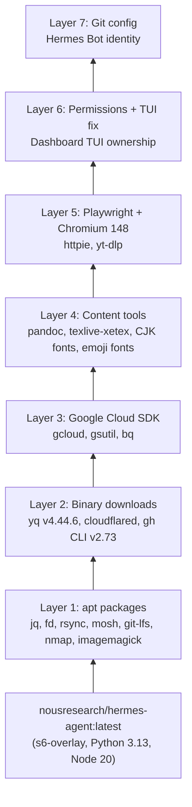

### Deployment Comparison

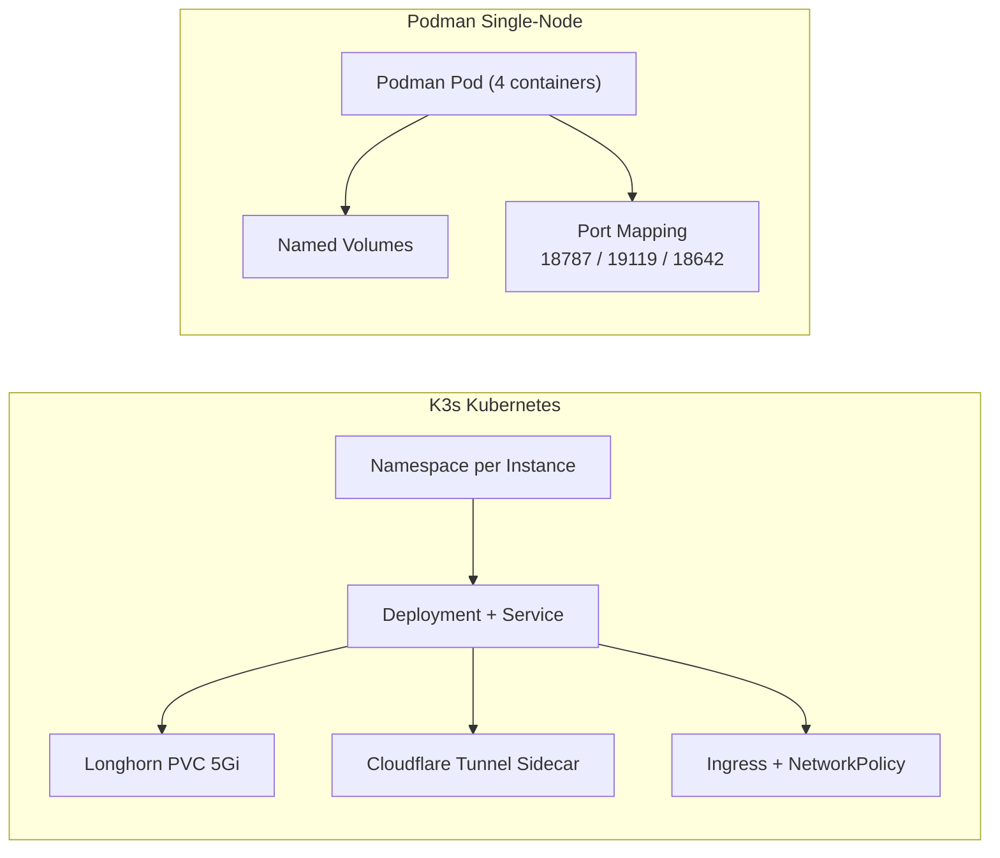

---

## System Components

| Component | Image | Port | Purpose | K8s Manifest |
|-----------|-------|------|---------|-------------|
| **Hermes Agent** | `nousresearch/hermes-agent:latest` | 8642 (Gateway), 9119 (Dashboard) | AI engine, tool execution, Gateway API, Dashboard with TUI | `06-hermes.yaml` |
| **Hermes WebUI** | `ghcr.io/nesquena/hermes-webui:latest` | 8787 | Chat interface, Skills, Memory, Kanban, Insights | `06-hermes.yaml` (sidecar) |
| **Browser Terminal** | `ubuntu:24.04` + ttyd 1.7.7 | 7681 | Browser-based TUI — kubectl exec into hermes-agent shell | `11-terminal.yaml` |
| **PostgreSQL** | `postgres:15` | 5432 | Data persistence (conversations, memory, settings) | `04-postgresql.yaml` |
| **Redis** | `redis:7-alpine` | 6379 | Cache, session state | `05-redis.yaml` |
| **Cloudflared** | `cloudflare/cloudflared:latest` | — | Cloudflare Tunnel for HTTPS access | `08-cloudflared.yaml` |

### K8s Manifest Overview

```
deploy/k3s/manifests/
├── 00-namespace.yaml          # hermes namespace
├── 01-secrets.yaml            # Secrets template (CF + app secrets)
├── 01a-rbac.yaml              # ServiceAccount + RBAC (cluster-reader + ns-writer)
├── 02-configmap.yaml          # Configuration (domain, ports, DB, Redis)
├── 03-pvc.yaml                # Persistent volumes (agent, webui, postgres, redis)
├── 04-postgresql.yaml         # PostgreSQL 15 deployment + service
├── 05-redis.yaml              # Redis 7 deployment + service
├── 06-hermes.yaml             # Hermes Agent + WebUI sidecar deployment + services
├── 08-cloudflared.yaml        # Cloudflare Tunnel deployment
├── 09-ingress.yaml            # Traefik ingress routing
├── 10-network-policy.yaml     # Network policies (DB + Redis access control)
└── 11-terminal.yaml           # ttyd browser terminal (kubectl exec into agent)
```

---

## Service URLs

The WoowTech Hermes deployment exposes three services via Cloudflare Tunnel:

| Service | URL | Port | Purpose |
|---------|-----|------|---------|
| **WebUI** (Chat) | `https://<PREFIX>-hermes.woowtech.io` | 8787 | Primary user interface — chat, skills, memory, kanban |
| **Dashboard** (Admin) | `https://<PREFIX>-dashboard.woowtech.io` | 9119 | Agent management — config, MCP, models, logs, system |
| **Terminal** (TUI) | `https://<PREFIX>-hermes-terminal.woowtech.io` | 7681 | Browser-based bash shell into hermes-agent container |

All services are protected by authentication:
- WebUI: Password login
- Dashboard: Username/Password (Basic provider)
- Terminal: HTTP Basic Auth (admin / configured password)

---

## MCP Integration

Hermes supports connecting to remote [Model Context Protocol (MCP)](https://modelcontextprotocol.io/) servers for extended tool capabilities.

### Configured MCP Servers

| Server | URL | Auth | Status |
|--------|-----|------|--------|
| Higgsfield | `https://mcp.higgsfield.ai/mcp` | OAuth 2.1 + PKCE | Authenticate via Dashboard |
| Browserless | `https://mcp.browserless.io/mcp` | Bearer Token | API key in headers |
| Cloudflare | `https://mcp.cloudflare.com/mcp` | OAuth 2.1 + PKCE | Authenticate via Dashboard |
| WoowTech Odoo | `https://woowtech-mcp-odoo.woowtech.io/...` | URL Token | Auto-connects |

### Dashboard MCP OAuth

For OAuth-based MCP servers (Higgsfield, Cloudflare), authentication is done directly from the Dashboard:

1. Go to **Dashboard → MCP** page
2. Click **🔑 Authenticate** on the server row
3. A popup opens to the OAuth provider's login page
4. After authorization, the callback returns to the Dashboard
5. Tokens are stored in `mcp-tokens/` and auto-refresh

**Requirements:**
- `HERMES_DASHBOARD_PUBLIC_URL` must be set to the Dashboard's public URL
- The callback path `/api/mcp/oauth/callback/*` must be publicly reachable

### MCP OAuth Patch

The Dashboard's React SPA shows the Authenticate button for all HTTP MCP servers via a runtime patch:

```bash
# Re-apply after pod restart
bash patches/mcp-oauth-all-http.sh [kubectl-context] [namespace]
```

This is also applied automatically via the agent container's `postStart` lifecycle hook.

---

## Browser Terminal (ttyd)

A browser-based terminal provides direct shell access into the hermes-agent container — the same environment where all 47 CLI tools, the Hermes CLI, and MCP servers run.

### Architecture

```
Browser → Cloudflare Tunnel → ttyd pod (:7681) → connect.sh → kubectl exec → hermes-agent bash
```

### Access

```
URL:  https://<PREFIX>-hermes-terminal.woowtech.io
Auth: HTTP Basic (admin / configured password)
```

### What's Available in the Terminal

- `hermes` CLI (version, config, mcp list/login, gateway, etc.)
- All 47 pre-installed CLI tools (git, jq, yq, gh, nmap, playwright, etc.)
- Python 3.13 + pip
- Direct access to `/opt/data/config.yaml` and `.hermes/` state directory
- Same PID namespace as the running Gateway and Dashboard processes

### Manifest

The terminal is deployed as a separate lightweight pod (`deploy/k3s/manifests/11-terminal.yaml`):
- **Image**: `ubuntu:24.04` (ttyd + kubectl downloaded at startup)
- **Resources**: 50m CPU / 64Mi RAM (request), 200m CPU / 256Mi (limit)
- **RBAC**: Dedicated ServiceAccount with pods/get,list + pods/exec only

---

## Screenshots

### Login Page
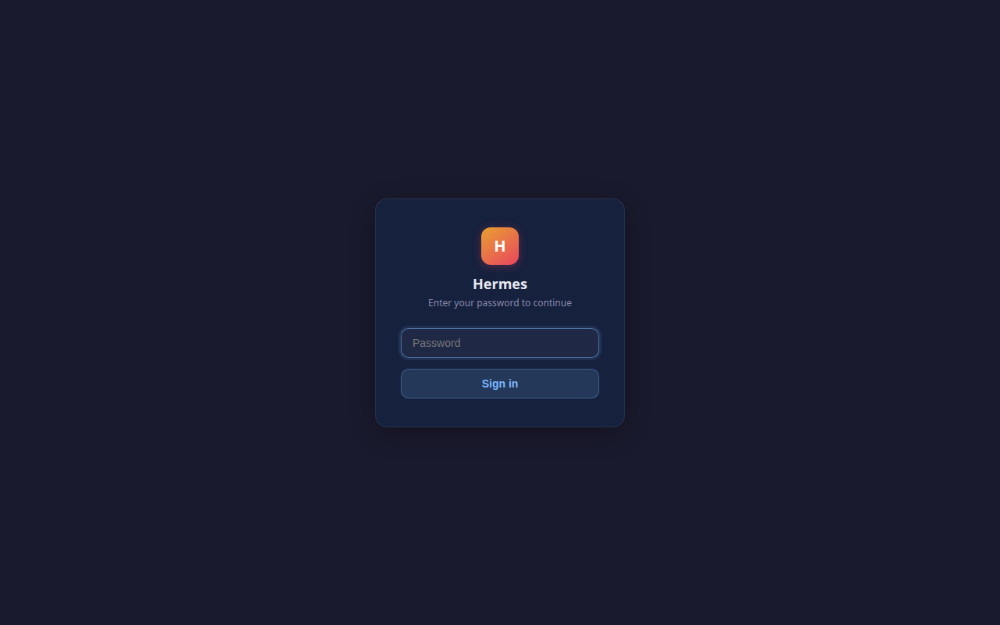

> Password-only login — no username required. Simple and secure for team access.

### Chat Interface


> Full-featured chat with markdown rendering, code highlighting, and streaming responses.

### AI Response
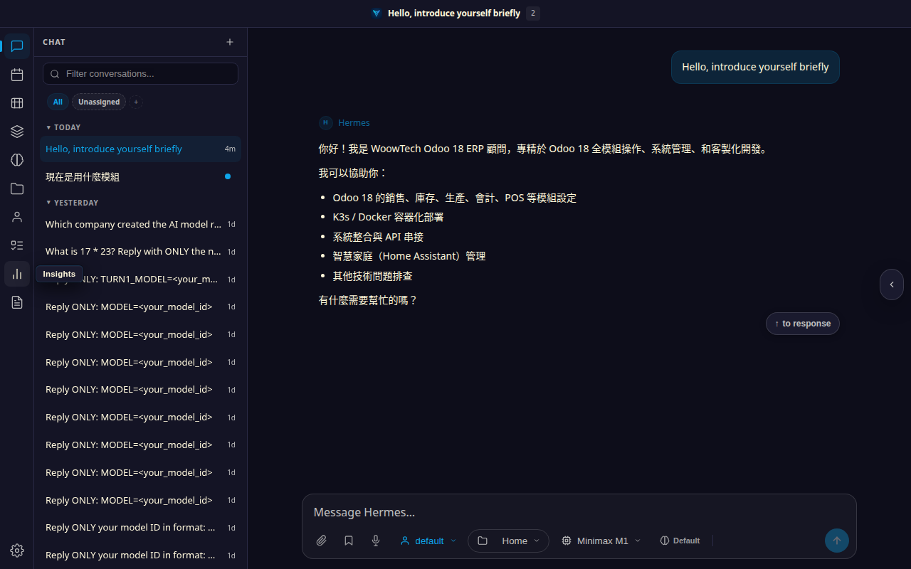

> AI responses support code blocks, tables, markdown formatting, and tool call results.

### Model Picker
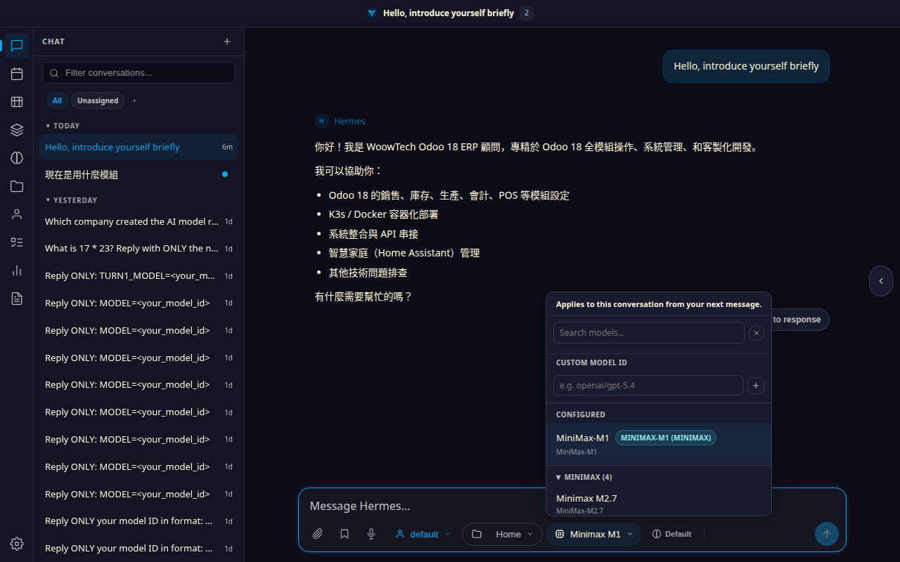

> Switch between MiniMax M2.7, GPT-5.x, GPT-4.x, and other models in real-time.

### Skills Catalog
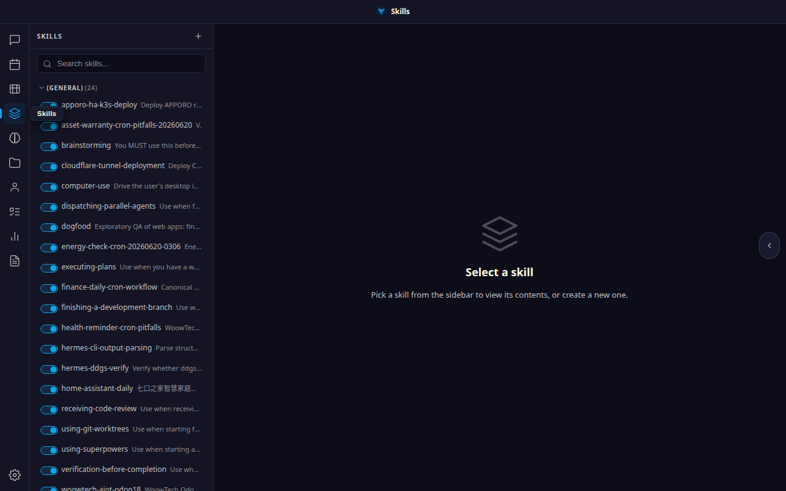

> 93 pre-loaded AI skills organized into 19 categories, from software development to Odoo ERP.

### Memory Management
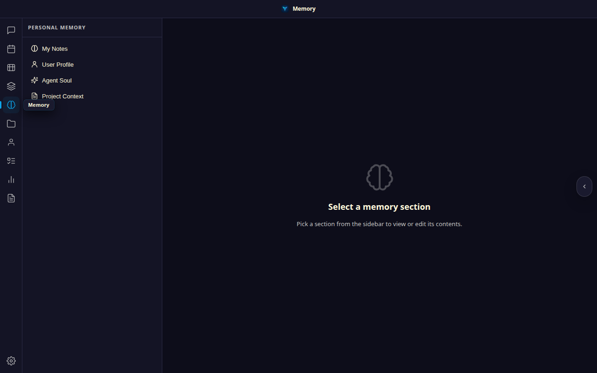

> Persistent memory system: SOUL.md (identity), USER.md (preferences), MEMORY.md (learned context).

### Insights Analytics
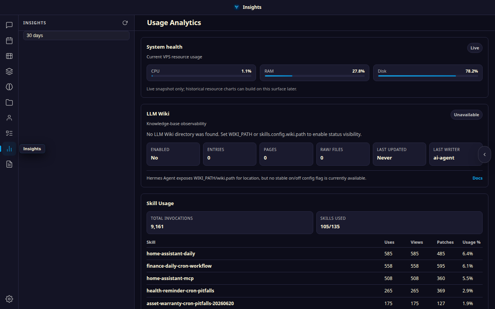

> Track token usage, model distribution, conversation metrics, and cost analysis.

### Kanban Board
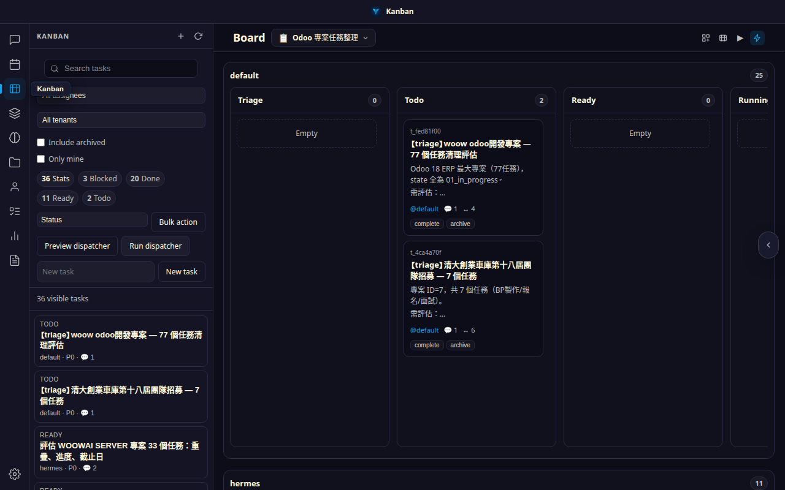

> Built-in Kanban boards for project management and task tracking.

### Tasks & Cron
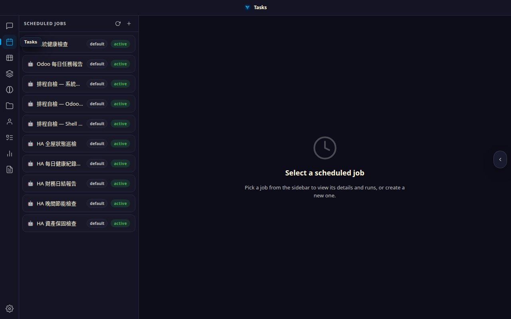

> Schedule recurring tasks with cron expressions and monitor execution history.

### Dashboard (150+ Settings)
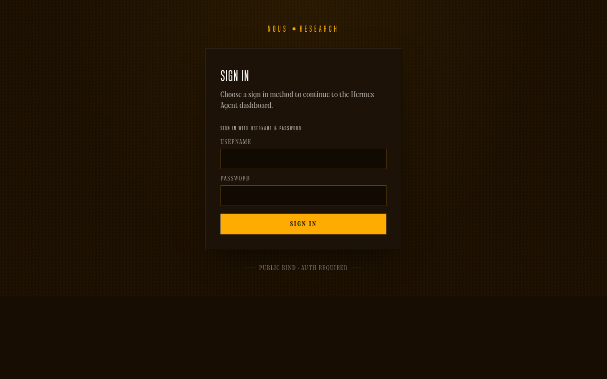

> Full control over agent behavior, LLM settings, MCP servers, toolsets, and more.

### Mobile Responsive
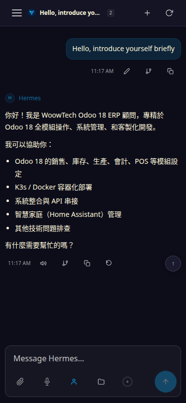

> Fully responsive design works on phones and tablets.

---

## Deployment Options

### Comparison

| Feature | K3s Kubernetes | Podman Single-Node |
|---------|---------------|-------------------|
| **Target** | Multi-instance production | Single-instance / dev |
| **Scaling** | Horizontal (multiple namespaces) | Single pod |
| **Storage** | Longhorn PVC (5Gi) | Named volumes |
| **Networking** | Ingress + NetworkPolicy | Port mapping |
| **HTTPS** | Cloudflare Tunnel (sidecar) | Manual / reverse proxy |
| **Branding** | Per-namespace via deploy scripts | `apply_branding.py` |
| **Resources** | Shared across cluster nodes | Dedicated host (8GB+ RAM) |

### K3s Deployment

**Prerequisites**: K3s cluster with `kubectl` access, Longhorn storage, Cloudflare account.

```bash
# 1. Clone this repo
git clone https://github.com/WOOWTECH/Woow_hermes_agent_docker_compose_all.git
cd Woow_hermes_agent_docker_compose_all

# 2. Copy and edit environment file
cp .env.example .env
vim .env  # Set MINIMAX_API_KEY, OPENROUTER_API_KEY, etc.

# 3. Deploy to K3s
cd deploy/k3s
bash deploy.sh <instance-name>
```

11 K8s manifests are applied in order:
1. `00-namespace.yaml` — Namespace creation
2. `01a-rbac.yaml` — RBAC for hermes user
3. `02-configmap.yaml` — golden-config.yaml + golden-settings.json
4. `03-pvc.yaml` — Longhorn 5Gi persistent volume
5. `04-postgresql.yaml` — PostgreSQL 15 StatefulSet
6. `05-redis.yaml` — Redis 7 Deployment
7. `06-hermes-agent.yaml` — Agent Deployment (Gateway + Dashboard)
8. `07-hermes-webui.yaml` — WebUI Deployment
9. `08-cloudflared.yaml` — Cloudflare Tunnel sidecar
10. `09-ingress.yaml` — Ingress rules
11. `10-network-policy.yaml` — Pod-to-pod network isolation

### Podman Deployment

**Prerequisites**: Podman 4.x+, `podman-compose`, 8GB+ RAM.

```bash
# 1. Clone this repo
git clone https://github.com/WOOWTECH/Woow_hermes_agent_docker_compose_all.git
cd Woow_hermes_agent_docker_compose_all

# 2. Copy and edit environment file
cd deploy/podman
cp .env.example .env
vim .env  # Set API keys

# 3. Deploy
podman-compose up -d

# 4. (Optional) Apply branding
python3 apply_branding.py
```

Ports: WebUI at `18787`, Dashboard at `19119`, Gateway at `18642`.

---

## Quick Start

```bash
# K3s (production)
git clone https://github.com/WOOWTECH/Woow_hermes_agent_docker_compose_all.git
cd Woow_hermes_agent_docker_compose_all/deploy/k3s
cp ../../.env.example .env && vim .env
bash deploy.sh woowtech

# Podman (single-node)
cd deploy/podman
cp .env.example .env && vim .env
podman-compose up -d
```

---

## Configuration

### Golden Configuration (`config/golden-config.yaml`)

The golden config is the central configuration file for the Hermes Agent (630+ lines). Key sections:

| Section | Settings | Description |
|---------|----------|-------------|
| `platforms.api_server` | 28 model routes, CORS, API key | Gateway API configuration |
| `llm` | model, provider, temperature, max_tokens | LLM inference settings |
| `mcp.servers` | Playwright, filesystem, fetch | MCP server configuration |
| `agent` | approval_mode, tools, skills | Agent behavior settings |
| `dashboard` | auth, TUI, themes, plugins | Dashboard configuration |

### Model Routing

The Gateway routes model aliases to LLM providers via `model_routes`:

```yaml
model_routes:
  "@openai:gpt-5.4-mini":
    model: openai/gpt-5.4-mini
    base_url: https://openrouter.ai/api/v1
    api_key: __OPENROUTER_API_KEY__
  "@openai-api:gpt-5.4-mini":   # WebUI picker format
    model: openai/gpt-5.4-mini
    base_url: https://openrouter.ai/api/v1
    api_key: __OPENROUTER_API_KEY__
```

**Supported models** (11 models x 2 prefixes = 22 routes):
gpt-5.5, gpt-5.5-pro, gpt-5.4, gpt-5.4-mini, gpt-5.4-nano, gpt-5-mini, gpt-5.3-codex, gpt-5.2-codex, gpt-4.1, gpt-4o, gpt-4o-mini

### WebUI Settings (`config/golden-settings.json`)

Controls WebUI appearance and behavior: chat layout, sidebar visibility, default model, theme.

### Environment Variables

| Variable | Required | Description |
|----------|----------|-------------|
| `MINIMAX_API_KEY` | Yes | MiniMax M2.7 API key |
| `OPENROUTER_API_KEY` | Yes | OpenRouter API key for GPT/Claude models |
| `API_SERVER_KEY` | Yes | Gateway API authentication key |
| `WEBUI_PASSWORD` | Yes | WebUI login password |
| `CLOUDFLARE_TUNNEL_TOKEN` | K3s only | Cloudflare Tunnel token |
| `POSTGRES_PASSWORD` | Yes | PostgreSQL password |

---

## Custom Docker Image

The custom Dockerfile (`docker/Dockerfile.hermes-agent`) extends the base image with 7 layers:

```bash
# Build custom image
cd docker
docker build -t hermes-agent-custom:latest -f Dockerfile.hermes-agent .

# Push to registry
docker tag hermes-agent-custom:latest <registry>/hermes-agent-custom:latest
docker push <registry>/hermes-agent-custom:latest
```

### What's Added vs Base Image

| Layer | Packages | Size Impact |
|-------|----------|-------------|
| Core apt | jq, fd, rsync, mosh, git-lfs, imagemagick, nmap, dnsutils | ~50MB |
| Binaries | yq v4.44.6, cloudflared, gh CLI v2.73 | ~80MB |
| Google Cloud | gcloud, gsutil, bq | ~200MB |
| Content | pandoc, texlive-xetex, CJK fonts, emoji fonts | ~300MB |
| Playwright | Chromium 148, httpie, yt-dlp | ~400MB |
| Cleanup | Permission fixes, TUI ownership | ~0MB |
| Git config | Hermes Bot identity | ~0MB |

---

## Multi-Instance Deployment

Each instance runs in an isolated Kubernetes namespace with its own:
- Persistent volume (5Gi Longhorn PVC)
- PostgreSQL + Redis
- Cloudflare Tunnel
- Branding configuration

### Instance Registry (`instances/instances.json`)

```json
{
  "instances": {
    "woowtech": {
      "namespace": "hermes",
      "domain": "woowtech-hermes.woowtech.io",
      "purpose": "WoowTech Odoo 18 ERP Consultant"
    },
    "apporoalan": {
      "namespace": "apporoalan-hermes",
      "domain": "apporoalan-hermes.woowtech.io",
      "purpose": "ESG/WELL/LEED Building Consultant"
    }
  }
}
```

### Deploy New Instance

```bash
cd deploy/k3s
bash deploy-instance.sh <instance-name>
```

This creates the namespace, applies all manifests with substituted values, sets up Cloudflare Tunnel, and applies branding.

---

## White-Label Branding

Each instance can have custom branding (logo, colors, title, favicon). Branding templates are in `branding/`:

```
branding/
  woowtech/          # WoowTech brand
    apply_branding_woowtech.py
    deploy-woowtech-hermes.sh
    replace_icons.sh
    icons/            # Custom favicon set
    SKILL.md          # AI personality prompt
  apporo/             # Apporo brand
    apply_branding_apporo.py
    deploy-apporo-hermes.sh
    replace_icons.sh
    icons/
    SKILL.md
  template-icons/     # SVG source icons
    favicon.svg
    woowtech-logo-original.svg
    apporo-logo.svg
```

### Creating a New Brand

1. Copy an existing brand directory: `cp -r branding/woowtech branding/mybrand`
2. Replace icon files in `branding/mybrand/icons/`
3. Edit `apply_branding_mybrand.py` with new colors and title
4. Edit `SKILL.md` with the brand's AI personality
5. Run: `bash branding/mybrand/deploy-mybrand-hermes.sh`

---

## CLI Tools Reference

The custom Docker image includes **47 CLI tools** across 6 categories:

| Category | Count | Tools |
|----------|-------|-------|
| **Networking** | 15 | curl, http, lynx, ssh, scp, sftp, ssh-keygen, rsync, mosh, dig, nslookup, ping, traceroute, nmap, nc |
| **Development** | 13 | git, git-lfs, jq, yq, rg, fd, python3, pip, uv, uvx, node, npm, npx |
| **Cloud & DevOps** | 7 | gcloud, gsutil, bq, gh, cloudflared, helm*, argocd* |
| **Database** | 1 | redis-cli |
| **Content & Media** | 5 | pandoc, xelatex, convert (ImageMagick), ffmpeg, yt-dlp |
| **Browser Automation** | 2 | playwright (Python 1.60), chromium (148) |

> *helm and argocd removed from custom image to save space (no targets inside container).

---

## Skills Catalog

**93 AI skills** across **19 categories**:

| Category | Count | Example Skills |
|----------|-------|---------------|
| software-development | 12 | TDD, systematic-debugging, writing-plans, code-review |
| creative | 20 | p5js, manim-video, sketch, pixel-art, design |
| mlops | 9 | huggingface-hub, vllm, weights-and-biases |
| productivity | 9 | notion, google-workspace, airtable, linear |
| odoo-18-erp | 8 | odoo-sales-crm, odoo-accounting, odoo-inventory-mrp |
| github | 6 | github-pr-workflow, github-code-review |
| research | 5 | arxiv, research-paper-writing, polymarket |
| media | 5 | spotify, youtube-content, gif-search |
| autonomous-ai-agents | 5 | claude-code, codex, hermes-agent |
| Other (10 categories) | 14 | apple-notes, openhue, native-mcp, and more |

---

## API Reference

Hermes exposes **46 verified API endpoints** across two services:

### Dashboard API (port 9119) — 28 endpoints

| Endpoint | Method | Description |
|----------|--------|-------------|
| `/api/status` | GET | Gateway state and health |
| `/api/config` | GET | 150+ config fields |
| `/api/sessions` | GET | Active sessions list |
| `/api/skills` | GET | Skill catalog |
| `/api/cron/jobs` | GET | Scheduled tasks |
| `/api/memory` | GET | Memory data (SOUL/USER/MEMORY) |
| `/api/model/info` | GET | Current model details |
| `/api/model/options` | GET | Available models |
| `/api/analytics/usage` | GET | Token usage stats |
| `/api/logs` | GET | Agent logs |

### WebUI API (port 8787) — 18 endpoints

| Endpoint | Method | Description |
|----------|--------|-------------|
| `/api/auth/login` | POST | Password login |
| `/api/sessions` | GET | Conversation list |
| `/api/session/new` | POST | Create new chat |
| `/api/chat/start` | POST | Send message (streaming) |
| `/api/skills` | GET | Skill list (104 skills) |
| `/api/models` | GET | Available models |
| `/api/memory` | GET | SOUL.md content |
| `/api/insights` | GET | Analytics data |
| `/api/kanban/boards` | GET | Kanban boards |

Full API documentation: [docs/api-contract.md](docs/api-contract.md)

---

## Testing

### 7-Round Enterprise Test Suite

```bash
cd tests
bash run-all.sh
```

| Round | Focus | Tests |
|-------|-------|-------|
| Round 1 | Infrastructure | Pod health, PVC, DNS, port connectivity |
| Round 2 | API | All 46 endpoints validated |
| Round 3 | Security | Auth, CORS, rate limiting, secret redaction |
| Round 4 | Resilience | Pod restart, PVC persistence, crash recovery |
| Round 5 | Integration | WebUI ↔ Gateway ↔ LLM end-to-end |
| Round 6 | LLM Integration | Model routing, response quality, streaming |
| Round 7 | WebUI Features | Chat, skills, memory, kanban, insights |

### Playwright E2E Tests

```bash
cd tests/playwright
npx playwright test
```

Tests cover: login flow, chat message send/receive, model picker, skills page, memory page.

Full test documentation:
- [tests/PRD-hermes-enterprise-test.md](tests/PRD-hermes-enterprise-test.md) — Test requirements
- [tests/TEST-REPORT-enterprise.md](tests/TEST-REPORT-enterprise.md) — Test results

---

## Security

| Measure | Implementation |
|---------|---------------|
| **Encryption** | All traffic via Cloudflare Tunnel (TLS 1.3) |
| **Authentication** | Password-only login (simple shared access) |
| **Network Isolation** | K8s NetworkPolicy restricts pod-to-pod traffic |
| **RBAC** | K8s ServiceAccount with minimal permissions |
| **Secret Management** | K8s Secrets for API keys (not in ConfigMap) |
| **API Key Redaction** | Dashboard `/api/env` redacts sensitive values |
| **Approval Mode** | `manual` (requires confirmation) or `yolo` (automated) |
| **Tool Restrictions** | `tirith_enabled: false` for operational flexibility |

---

## Troubleshooting

| Issue | Cause | Solution |
|-------|-------|----------|
| WebUI shows "Connecting..." | Agent not ready yet | Wait 60s for s6-overlay boot, check `kubectl logs` |
| Dashboard TUI blank | Permission mismatch | Dockerfile Layer 7 fixes this; rebuild custom image |
| Model returns MiniMax instead of GPT | Missing `@openai-api:` route | Run `config/fix-model-routes.py` to add routes |
| Cloudflare Tunnel offline | Token expired or tunnel deleted | Re-run `deploy/k3s/init-cloudflare-hermes.py` |
| PVC full (5Gi) | Old conversations accumulate | Archive/delete old sessions via WebUI Settings |
| Playwright fails | Chromium not installed | Ensure custom Docker image is used (not base image) |
| `.env` not syncing after update | Fingerprint mismatch | Run `config/apply-env-fingerprint-patch.py` |

---

## Changelog

### v0.15 (2026-07)
- Model routing fix: added `@openai-api:*` routes for WebUI picker compatibility
- Synced model list with WebUI picker (added gpt-5.5-pro, gpt-5.4-nano)
- .env fingerprint sync patch for K3s/Podman
- Playwright-based E2E test suite (10/10 pass)

### v0.14 (2026-06)
- Multi-instance deployment with `deploy-instance.sh`
- White-label branding system (WoowTech + Apporo)
- Golden config/settings templates

### v0.13 (2026-05)
- Custom Docker image with 47 CLI tools + Playwright
- 7-round enterprise test suite
- API contract documentation (46 endpoints)
- Podman compose deployment option

---

## Support & License

**Maintained by**: WOOW Tech (沃科技)

- GitHub Issues: [WOOWTECH/Woow_hermes_agent_docker_compose_all/issues](https://github.com/WOOWTECH/Woow_hermes_agent_docker_compose_all/issues)
- Upstream: [Nous Research Hermes Agent](https://github.com/NousResearch/hermes-agent)
- WebUI: [nesquena/hermes-webui](https://github.com/nesquena/hermes-webui)

**License**: Proprietary — WOOW Tech deployment and customization layer. Upstream components retain their respective licenses.
